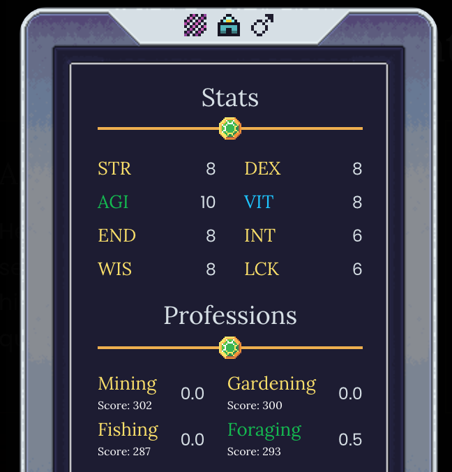

# DeFi Kingdoms Profession Scores Extension

This extensions adds profession scores to hero cards using [the same method provided by Kingdom Watch](https://kingdom.watch/about/heroranking ) in their scoring data.

Example:

## Install

Download and install the extension from the **[chrome web store page](https://chrome.google.com/webstore/detail/defi-kingdoms-profession/pklfcddomaflmgkinpcmendfkkdopnlp)**.

## Local Development

1. Check if your [Node.js](https://nodejs.org/) version is >= **14**.
5. Run `npm install` to install the dependencies.
6. Run `npm start`
7. Load your extension on Chrome following:
   1. Access `chrome://extensions/`
   2. Check `Developer mode`
   3. Click on `Load unpacked extension`
   4. Select the `build` folder.

## Contact

Look for the gudetama on Twitter at [@dukeofdolma](https://twitter.com/dukeofdolma) or Discord at duke#0561